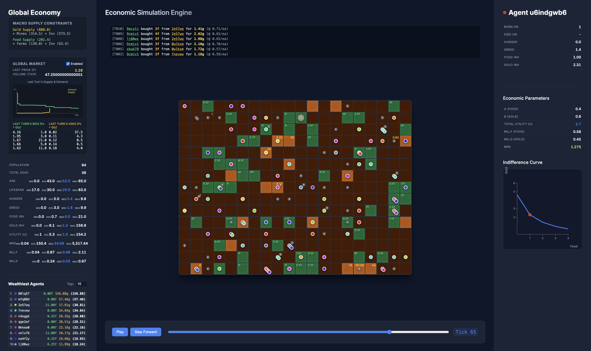

# Economy Simulator

An economy simulator that models the emergent behavior of agents gathering and trading resources based on their resource bundle preferences in a bartering economy. Agents accumulate hunger (bias towards food) over time and have a static greed (bias towards gold). From these two biases, the usage of a commodity (gold, in this case) as a currency emerges naturally emerges in some worlds--demonstrating how monetary economies can emerge from bartering economies. Phenomena such as supply, demand, and price equilibrium emerge without any centralized control.

I made this to exercise the concepts I learned in the excellent [MIT OpenCourseware Introduction to Microeconomics course](https://ocw.mit.edu/courses/14-01sc-principles-of-microeconomics-fall-2011/pages/unit-1-supply-and-demand/introduction-to-microeconomics/).



## The Economics

This simulation implements several foundational microeconomic concepts to drive agent behavior:

### Resource Collection (Gold and Food)
Agents navigate a procedural grid world to collect resources. Food is necessary for survival and is consumed every "tick" to stave off starvation. Gold, on the other hand, is inherently useless (it is just shiny) but often emerges in some worlds with sufficiently greedy populations as a store of value and medium of exchange. The scarcity and location of these resources dictate the macro supply of the economy.

### Indifference Curves via Hunger and Greed
Every agent has assigned personality traits: hunger and greed. These variables act as parameters that shape an agent's utility function, yielding personalized **indifference curves**. An indifference curve represents combinations of food and gold (consumption bundles) that provide the exact same level of utility to an agent. For example, a starving agent will have a steep indifference curve strongly favoring food, while a well-fed but greedy agent will have a curve reflecting a strong preference for gold. Even staring greedy agents will have a strong indifference curve favoring food, so as to ensure survival.

The simulation models this preference using a modified **Cobb-Douglas Utility Function**:

$$ U(F, G) = (F + 1)^\alpha (G + 1)^\beta $$

Where $F$ is the agent's food inventory, $G$ is the gold inventory, and $\alpha$ and $\beta$ are the relative preference weights. These parameters are derived dynamically from the agent's current hunger scale and baseline greed, normalized such that $\alpha + \beta = 1$. The $+1$ offsets ensure mathematical stability, preventing undefined bounds when an agent completely depletes a resource.

### Marginal Rate of Substitution (MRS)
Derived directly from the indifference curve, the Marginal Rate of Substitution (MRS) represents the exact amount of gold an agent is willing to trade for one unit of food at their current state. The MRS corresponds to the slope of the indifference curve at the agent's current inventory levels. This dynamically changes as they consume food or acquire more gold. 

Mathematically, the MRS is the ratio of the Marginal Utility of Food ($MU_F$) to the Marginal Utility of Gold ($MU_G$).

The **Marginal Utility of Food** (the partial derivative of the utility function with respect to food) is defined as:

$$ MU_F = \frac{\partial U}{\partial F} = \alpha (F + 1)^{\alpha - 1} (G + 1)^\beta $$

The **Marginal Utility of Gold** (the partial derivative with respect to gold) is:

$$ MU_G = \frac{\partial U}{\partial G} = \beta (F + 1)^\alpha (G + 1)^{\beta - 1} $$

Thus, the **Marginal Rate of Substitution** simplifies to:

$$ MRS = \frac{MU_F}{MU_G} = \frac{\alpha}{\beta} \frac{G + 1}{F + 1} $$

This calculated $MRS$ becomes the agent's exact threshold price—dictating whether they submit a buy order or a sell order in the open market.

### The Trading Mechanism
At the end of each tick, agents participate in a global market. Using their MRS and the previous tick’s market price, agents submit bids (if they value food more than the market price) or asks (if they value it less). The market is implemented with an order book, matching the highest bids with the lowest asks to find an equilibrium clearing price. Through this mechanism, resources flow from those who have a surplus to those who need them most, driving economic efficiency and often enabling the survival and even thriving of overly greedy agents who are too gold-focused to want to collect food until they are about to starve to death.

### Emergent Complexity
Despite agents acting purely on simple, local utility maximization logic without any awareness of the global state, complex macroeconomic patterns naturally emerge. Wealth tends to concentrate among agents who are either geographically lucky or value gold/food appropriately based on the scaricty of each resource in the world and the greed/hunger of their peers. In a world of gold-scarcity and greedy agents, gold will be extremely valuable. In a world of food-scarcity and hungry agents, food will be extremely valuable. Market prices fluctuate dynamically based on total resource scarcity, and population dynamics are continuously shaped by starvation. The economy balances itself purely through decentralized rational choices.

## Building and Running

To build and run the simulation locally, ensure you have [Bun](https://bun.sh/) installed.

1. Install dependencies:
   ```bash
   bun install
   ```

2. Start the development server:
   ```bash
   bun run dev
   ```

3. Open the provided localhost URL in your browser to view the simulation (typically `http://localhost:5173`). Click the **Play** button to begin the simulation.
